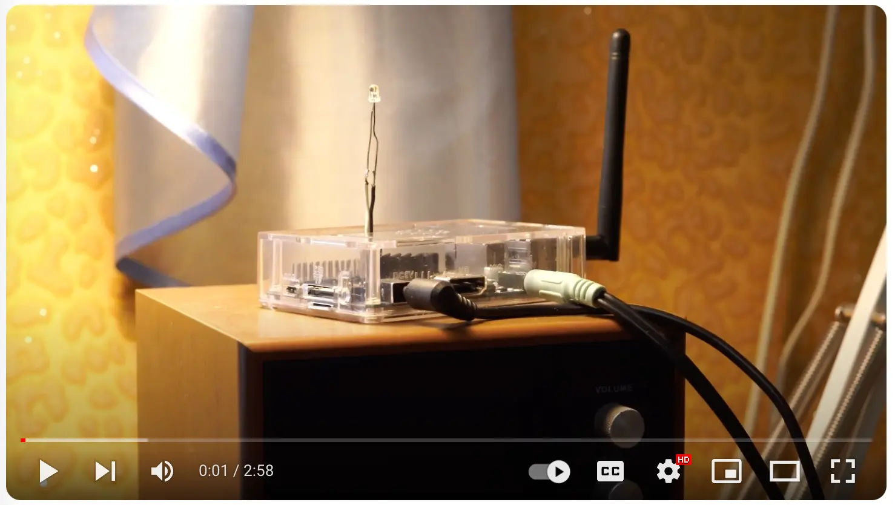

## Intro

After weeks of tinkering and coding, I'm thrilled to announce that I've successfully created a custom voice assistant using a blend of innovative tools and technologies.


Leveraging the power of Langchains, OpenAI's ChatGPT, Langchains agents, and various retrieval tools, I've crafted an assistant that not only understands and responds to natural language but can also search the web via DuckDuckGo, fetch information from Wikipedia, check the weather with OpenWeatherMap, and stream content directly from YouTube!


The most exciting part? This entire project is running smoothly on a Quad-core ARMv7 OrangePiPc (a single board computer similar to Raspberry Pi 3). I am sure that on arm64 with GPU cores (like Nvidia Jetson Nano) I can run everything locally (including Mistral-7B or LLamav2), but on this hardware I run everything on the Cloud.

## Demo

[ ](https://youtu.be/DmsoqtqpCfA)

## Reasons 
This is ChatGPT powered Voice Assistant. You probably found a lot projects like this. What do you think I created one more?

1. I needed an assistant that could work on armv7. A lot of projects was designed for arm64. For instance Microsoft Speech Services python library is not available for armv7. 
2. I needed an assistant that can play music from youtube and tell me the weather.
3. I need an assistant that supports English, Russian and Ukranian.
4. I tried to install OpenVoiceOS and Mycroft on armv7 orangepipc, but a lot of components are not available out of the box.

## How first prototype looks like


## Components

- rhvoice.org - Text-to-Speech
- SpeechRecognition - Speech-to-Text (google)
- langchains + langchains_openai
- yt-dlp for streaming from youtube
- openweathermap API


## Run & Debug
Disclaimer: This is erly stages sofware and tested only on OrangePiPc

- Install Armbian on the Single Board Computer and ssh to it
- Copy (rsync) the installation scripts and `src/` to `/opt/VoiceAssistant/`. You (you can use script scripts/sync-code.sh)
- Set API keys in .env file /opt/VoiceAssistant/.env
- Unmute the mic in the `alsamixer`: 1. Run `alsamixer`. 2. Press F4, navigate to the mic, and press `Space`. You will see that the mic is now enabled. Repeat for all mic devices. 
- [OrangePi Only] Disable ZRAM, prevent Zram mount into /tmp. Otherwise `pip install` could fail because `Out of space`. Edit `/etc/default/armbian-zram-config`, set `ENABLED=false`. You can set it back after the dependencies installation.
- `/opt/VoiceAssistant/install-dependencies.sh` - this script will install all the dependencies, create a user, and then start a `voice-assistant.service`


## Hardware specification

### [OrangePi PC](http://www.orangepi.org/orangepiwiki/index.php/Orange_Pi_PC)
CPU: Allwinner H3 ARM Cortex-A7 Quad Core
Memory: 1GB

### Dev emulator
Qemu hardware emulation: https://www.qemu.org/docs/master/system/arm/orangepi.html
```shell
qemu-system-arm -M orangepi-pc -sd mycard.img -global allwinner-rtc.base-year=2000
```

### MacOS develpoment
```shell
brew install -y pkg-config cairo
pip install -r src/requirements.txt
python3 src/main.py
```

## Known-issues

- [Skips a few first words. ALSA/DAC issue](https://forum.armbian.com/topic/33427-orangepipc-alsa-playvlc-skips-a-few-seconds-of-the-audio/)


## Ideas

Port to android 4.1, use ReactNative + [picovoice](https://medium.com/picovoice/no-way-google-build-your-own-wake-word-service-on-android-339a0189ff4c)