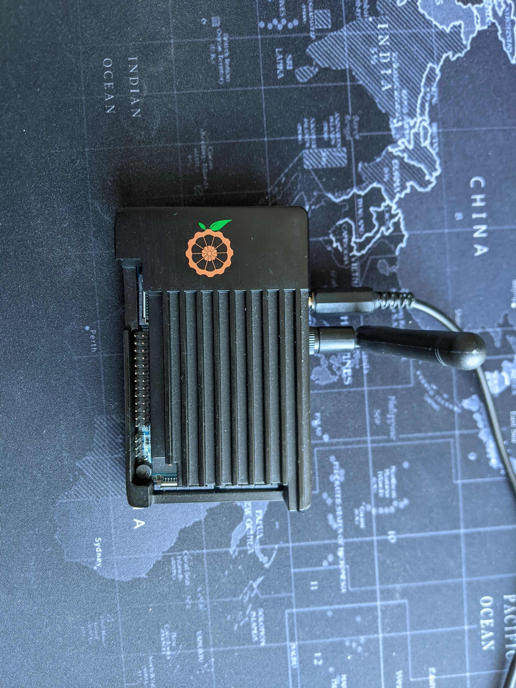

I recently decided to take on the task of building a voice assistant for my parents using a Raspberry Pi or Orangepi. Not only did I need a good text-to-speech (TTS) library, but I also needed something that would support Russian and Ukrainian, since that's what my parents speak. So, I set out on a journey to find the best TTS and speech-to-text (STT) libraries for Arm-enabled single board computers.



# Text-to-Speech

## eSpeak

```bash
sudo apt install espeak
espeak  -vru "Привет, как дела?"
```
First, I tried eSpeak. 🙄 But let's just say that the quality was not up to my standards, so I moved on.

## Festival

Demo
```bash
sudo apt install festival festvox-ru
echo "Привет! Как дела?" | festival --tts --language russian
```


```bash
sudo apt install -yq pkg-config scons git

```

Next, I tried Festival 🎉. While the quality wasn't amazing, it was decent enough for me to understand.

## [RHVoice](https://github.com/RHVoice/RHVoice/blob/master/doc/ru/Compiling-on-Linux.md)

```bash
sudo apt install rhvoice rhvoice-russian
echo "Привет, как дела?" | RHVoice-client -s Elena | aplay
```

But then I found RHVoice.👌 This TTS library had better quality and sounded almost as good as TTS (my top pick).

Voice profiles could be found there
```shell
$ ls /usr/share/RHVoice/voices/
alan	   aleksandr-hq  arina	  bdl  elena	    evgeniy-rus  lyubov   pavel  tatiana   vitaliy
aleksandr  anna		 artemiy  clb  evgeniy-eng  irina	 mikhail  slt	 victoria  yuriy
```


## RHVoice + speech-dispatcher

```shell
apt install speech-dispatcher speech-dispatcher-rhvoice rhvoice rhvoice-english rhvoice-russian
```

Edit /etc/speech-dispatcher/speechd.conf

```conf
DefaultModule rhvoice
```

and you can change a voice settings at `/etc/speech-dispatcher/modules/rhvoice.conf `

```bash
spd-say -o rhvoice -y aleksandr-hq "Привет, как дела?!"
```

With a linux `speech-dispatcher` interface it works even better, because you don't need to wait for a whole input "processing" and you hear shound immediately.


## [TTS](https://github.com/coqui-ai/TTS)

```bash
pip3 install TTS
tts "Hello, world"
paplay output.wav
```

The best quality, almost realtime on OrangePi4, but doesn't have good Russian models.

## Conclusion

I also tried Azure Speech Services, but it took a few weeks to make it work on latest Armbian/aarch64. Also, Microsoft library doesn't support arvm7 for python modules, so this is not an option. Therefore my choice is `rhvoice`.

# Speech Recognition

## Cloud Speech Recognition

Cloud Speech Services

|Service Name            | Free tier h/month|
|------------------------|------------------|
|Azure Speech Services   | 5h               |
|Google Cloud            | 1h               |
|IBM Cloud               |                  |


https://pypi.org/project/azure-cognitiveservices-speech/
https://github.com/Azure/azure-sdk-for-python/issues
# AI Speech-to-Text recognition libraries

| Name                      | Recognition time on RPi3 (speech duration/recogntion duration) |
|-----------                |--------------------------                                      |
|Mozilla Deep Speech Tflite | 2/10s|
|[Vosk-Api](https://github.com/alphacep/vosk-api)                  | 60/90s|
|Tensorflow ASR             |
|Whisper                    |

Finally, after testing a few different STT options, I settled on Vosk-Api. 🤘This library had a longer recognition time, but was still the best option for me since it had the best accuracy.
In conclusion, building a voice assistant takes a lot of research and testing, but finding the right TTS and STT libraries is key. Plus, making sure to support multiple languages is extremely important.


## Device Test

```bash

arecord -f S16_LE -r 44100 sample.wav
aplay sample.wav

```

## Python's speechrecognition

https://github.com/Uberi/speech_recognition

supported engines:
- Google offline
- Google Cloud API
- Whisper offline
- Whisper API
- Wit.ai
- Microsoft Speech Recognition
- Vosk API

Examples: https://github.com/Uberi/speech_recognition/blob/master/examples/microphone_recognition.py

# Other

## AI
[GPT explanation](https://www.datacamp.com/blog/what-we-know-gpt4)

> One objective benefit is that the GPT-4 API accepts a request with a context length of 8,192 tokens (12.5 pages of text) — this is 2x the context length of GPT-3.5.
> The GPT-4 API is 14x-29x more expensive than ChatGPT’s default model, gpt-3.5-turbo.
> The most difficult choice to make when deciding whether to use the GPT-4 API is pricing — as GPT-4 pricing works as follows:
prompt: $0.03 per 750 words (1k tokens)
completions: $0.06 per 750 words (1k tokens)
[Reference](https://medium.com/sopmac-ai/gpt-4-api-reference-guide-e4ba18bcbc5f)


### GPT system role

[Reference](https://community.openai.com/t/the-system-role-how-it-influences-the-chat-behavior/87353)


### Implementations
[Microsoft Converstational Speaker](https://github.com/microsoft/conversational-speaker)
[FrinedBot](https://www.hackster.io/484625/ai-conversation-speaker-aka-friend-bot-part-1-conversation-3adca1)
[Clippy](https://www.hackster.io/david-packman/clippygpt-6a683a#overview)
[Davinchi](https://www.hackster.io/devmiser/davinci-the-chatgpt-ai-virtual-assistant-you-can-talk-to-fd00fd)
[Azure OpenAI + Azure Speech Services](https://levelup.gitconnected.com/integrating-azure-openai-and-azure-speech-services-to-create-a-voice-enabled-chatbot-with-python-60a39f838367)
[Intune AI Voice Bot](https://jannikreinhard.com/2023/04/23/intune-ai-voice-bot/)


## Pulseaudio
pulsemixer
apt install systemd-container
machinectl shell user@ /bin/bash


## Troubleshooting

1. You have hit your assigned rate limit.
> openai.error.RateLimitError: You exceeded your current quota, please check your plan and billing details.
RateLimitError	Cause: You have hit your assigned rate limit.
Solution: Pace your requests. Read more in our rate limit guide.

2.  [`synthesizer_create_speech_synthesizer_from_config+0x10c` crash](https://github.com/Azure-Samples/cognitive-services-speech-sdk/issues/1969)
> cognitiveservices/speech/libMicrosoft.CognitiveServices.Speech.core.so(synthesizer_create_speech_synthesizer_from_config+0x10c) [0xffff7df6f9f8]
/lib/aarch64-linux-gnu/libffi.so.8(+0x6e10) [0xffff7e3d6e10]
/lib/aarch64-linux-gnu/libffi.so.8(+0x3a94) [0xffff7e3d3a94]
/usr/lib/python3.10/lib-dynload/_ctypes.cpython-310-aarch64-linux-gnu.so(+0x12b10) [0xffff7e402b10]
[CALL STACK END]

```bash
wget "http://ports.ubuntu.com/ubuntu-ports/pool/main/o/openssl/libssl1.1_1.1.1-1ubuntu2.1~18.04.23_arm64.deb"
dpkg -i ./libssl1.1_1.1.1-1ubuntu2.1~18.04.23_arm64.deb
```


2. Pulseaudio

```bash
pactl list sources | grep "Name:"
# Name: alsa_output.platform-es8316c-card.stereo-fallback.monitor
# Name: alsa_input.platform-es8316c-card.stereo-fallback
# Name: alsa_output.platform-hdmi-sound.stereo-fallback.monitor
device=alsa_input.platform-es8316c-card.stereo-fallback
parec --device ${device} --format=s16le --channels=2 --rate=44100 --file-format=wav output.wav
paplay output.wav

paplay /usr/share/sounds/alsa/Front_Right.wav
paplay /usr/share/sounds/alsa/Front_Left.wav
```

3. Install rust

To build some dependencies Rust is required
```shell
curl --proto '=https' --tlsv1.2 -sSf https://sh.rustup.rs | sh
```

# Sandbox

## wakeword

```shell
apt-get install libspeexdsp-dev portaudio
```
